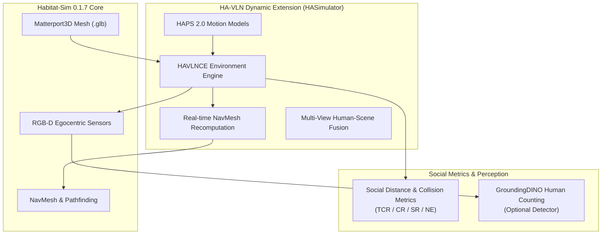
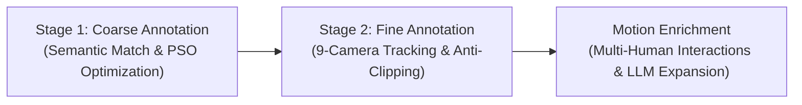
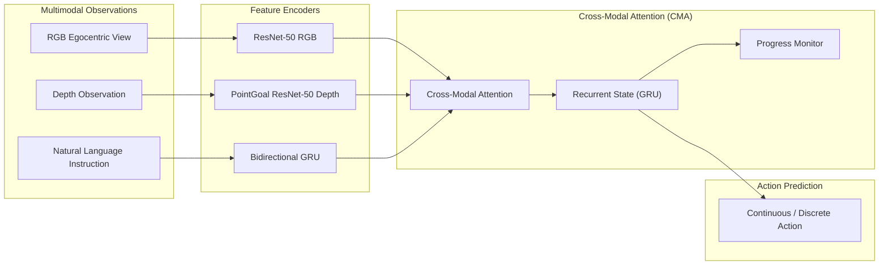

<br>
<p align="center">

<h1 align="center"><strong>HA-VLN 2.0: An Open Benchmark and Leaderboard for Human-Aware Navigation in Discrete and Continuous Environments with Dynamic Multi-Human Interactions</strong></h1>
  <p align="center"><span><a href=""></a></span>
              <a>Yifei Dong<sup>1,*</sup>,</a>
              <a>Fengyi Wu<sup>1,*</sup>,</a>
              <a>Qi He<sup>1</sup>,</a>
              <a>Lingdong Kong<sup>2</sup>,</a>
              <a>Heng Li<sup>1</sup>,</a>
              <a>Minghan Li<sup>1</sup>,</a>
              <a>Zebang Cheng<sup>1</sup>,</a>
              <a>Yuxuan Zhou<sup>1</sup>,</a>
              <a>Jingdong Sun<sup>3</sup>,</a>
              <a>Qi Dai<sup>4</sup>,</a>
              <a>Alexander G. Hauptmann<sup>3</sup>,</a>
              <a>Zhi-Qi Cheng<sup>1,†</sup></a>
    <br>
    <sup>1</sup>UW, <sup>2</sup>NUS, <sup>3</sup>CMU, <sup>4</sup>Microsoft Research<br>
  </p>

<p align="center">
  <a href="https://arxiv.org/abs/2503.14229" target="_blank">
    
  </a>
  <a href="https://uwmilab.github.io/HA-VLN-webpage" target="_blank">
    
  </a>
  <a href="https://huggingface.co/datasets/fly1113/HA-VLN" target="_blank">
    
  </a>
  <a href="https://drive.google.com/drive/folders/1WrdsRSPp-xJkImZ3CnI7Ho90lnhzp5GR?usp=sharing" target="_blank">
    
  </a>
  <a href="https://f1y1113.github.io/havln-challenge/" target="_blank">
    
  </a>
  <a href="https://github.com/UWMILab/HA-VLN/blob/main/LICENSE" target="_blank">
    
  </a>
</p>

<div align="center">
  
</div>

## 📰 News

- **[2026-09]** 🏆 We are organizing the [**HA-VLN track**](https://f1y1113.github.io/havln-challenge/) of the [RoboWorld Challenge 2026](https://roboworld2026.github.io/), affiliated with the [RoboPAD Workshop](https://robotpad2026.github.io/) at NeurIPS 2026. Join us in advancing human-aware navigation, participants from all backgrounds are welcome!
- **[2026-06]** 🎉 [HA-VLN 2.0](https://uwmilab.github.io/HA-VLN-webpage) has been accepted to **IROS 2026**!
- **[2025-08]** We have substantially upgraded the repository and improved usability, and organized a small-scale internal competition to support testing and community feedback.
- **[2025-03]** 🚀 We release [HA-VLN 2.0](https://uwmilab.github.io/HA-VLN-webpage), unifying discrete and continuous human-aware navigation with **HAPS 2.0**, dynamic multi-human interactions, and social-awareness evaluation across **16,844 instructions**, check our [Technical Report](https://arxiv.org/abs/2503.14229)!
- **[2024-09]** 🎉 HA-VLN 1.0 has been accepted to the NeurIPS 2024 Datasets and Benchmarks Track!

## 🧭 What does HA-VLN 2.0 look like?

| Navigation Demo 1 | Navigation Demo 2 |
|:---:|:---:|
|  |  |
| <details><summary><b>Navigation Instruction:</b> Start by moving forward in the lounge area, <b>where an individual is engaged in a phone conversation while pacing back and forth</b>. Navigate carefully to avoid crossing their path... <i>(Click to expand)</i></summary><br>As you proceed, you will pass by a television mounted on the wall. Continue your movement, <b>observing people relaxing and watching the TV, some seated comfortably on sofas</b>. Further along, <b>notice a group of friends raising their glasses in a toast, enjoying cocktails together</b>. Maintain a steady course, ensuring you do not disrupt their gathering. Finally, reach the end of your path where a potted plant is situated next to a door. Stop at this location, positioning yourself near the plant and door without obstructing access.</details> | <details><summary><b>Navigation Instruction:</b> Exit the room and make a left turn. Proceed down the hallway <b>where an individual is ironing clothes, carefully smoothing out wrinkles on garments</b>. Continue walking and make another left turn... <i>(Click to expand)</i></summary><br>Enter the next room, which is a bedroom. Inside, <b>someone is comfortably seated in bed, engrossed in reading a book</b>. Move past the bed, ensuring not to disturb the reader. Turn left again to enter the bathroom. Once inside, position yourself near the sink and wait there, observing the surroundings without interfering with any activities.</details> |

If you find this repository or our paper useful, please consider **starring** this repository and **citing** our paper. You are also welcome to explore our recent works on world modeling for navigation, including [**LCVN**](https://github.com/UWMILab/LCVN) (**NeurIPS 2026 Oral**), [**UniWM**](https://github.com/F1y1113/UniWM) (**ECCV 2026**), and [**GOViG**](https://github.com/F1y1113/GoViG) (**ACL 2026**).
```bibtex
@inproceedings{dong2026havln,
  author    = {Dong, Yifei and Wu, Fengyi and He, Qi and Kong, Lingdong and Li, Heng and Li, Minghan and Cheng, Zebang and Zhou, Yuxuan and Sun, Jingdong and Dai, Qi and Alexander G. Hauptmann and Cheng, Zhi-Qi},
  title     = {{HA-VLN 2.0: An Open Benchmark and Leaderboard for Human-Aware Navigation in Discrete and Continuous Environments with Dynamic Multi-Human Interactions}},
  booktitle = {2026 IEEE/RSJ International Conference on Intelligent Robots and Systems (IROS)},
  year      = {2026},
}
```

## Abstract

We present Human-Aware Vision-and-Language Navigation (**HA-VLN**), expanding VLN to include both discrete (**HA-VLN-DE**) and continuous (**HA-VLN-CE**) environments with social behaviors. The [HA-VLN Simulator](HASimulator) enables real-time rendering of human activities and provides unified APIs for navigation development. It introduces the Human Activity and Pose Simulation ([**HAPS 2.0 Dataset**](Data/HAPS2_0)) with detailed 3D human motion models and the HA Room-to-Room ([**HA-R2R**](Data/HA-R2R)) Dataset with complex navigation instructions that include human activities. We propose an HA-VLN Vision-and-Language model ([**HA-VLN-VL**](agent)) and a Cross-Model Attention model ([**HA-VLN-CMA**](agent)) to address visual-language understanding and dynamic decision-making challenges.

## Table of Contents

- [🚀 Quick Start](#-quick-start)
  - [1. Clone Repository](#1-clone-repository)
  - [2. Download Datasets & Checkpoint](#2-download-datasets--checkpoint)
  - [3. Reproduce Baseline with Docker](#3-reproduce-baseline-with-docker)
  - [Alternative: Native Installation](#alternative-native-installation)
- [🎮 HA-VLN Simulator (HASimulator)](#-ha-vln-simulator-hasimulator)
  - [1. Architecture Overview](#1-architecture-overview)
  - [2. Real-time Human Rendering](#2-real-time-human-rendering)
  - [3. Human-Scene Fusion (Multi-View Rendering)](#3-human-scene-fusion-multi-view-rendering)
  - [4. Simulator APIs & Social Measurements](#4-simulator-apis--social-measurements)
  - [5. Interactive Scene Exploration](#5-interactive-scene-exploration)
  - [6. GroundingDINO Setup for Human Counting (Optional)](#6-groundingdino-setup-for-human-counting-optional)
  - [7. Simulator Installation](#7-simulator-installation)
- [📊 HAPS 2.0 & HA-R2R Datasets (Data)](#-haps-20--ha-r2r-datasets-data)
  - [1. Dataset Organization](#1-dataset-organization)
  - [2. Dataset Download & Breakdown](#2-dataset-download--breakdown)
  - [3. HAPS Dataset 2.0 (3D Human Motion Models)](#3-haps-dataset-20-3d-human-motion-models)
  - [4. HA-R2R Dataset (Navigation Instructions)](#4-ha-r2r-dataset-navigation-instructions)
  - [5. Human Activities Annotation Pipeline](#5-human-activities-annotation-pipeline)
- [🤖 HA-VLN-CMA Baseline Agent (agent)](#-ha-vln-cma-baseline-agent-agent)
  - [1. Policy Architecture](#1-policy-architecture)
  - [2. Agent Setup & Dependencies](#2-agent-setup--dependencies)
  - [3. Training from Scratch](#3-training-from-scratch)
  - [4. Evaluation & Validation](#4-evaluation--validation)
  - [5. Test Inference & Submission](#5-test-inference--submission)
- [Contributing](#contributing) · [Citation](#citation) · [License](#license)

---

## 🚀 Quick Start

In this section, you will download the necessary datasets, set up the Docker environment, and reproduce our proposed **HA-VLN-CMA** baseline model.

### 1. Clone Repository

```bash
git clone https://github.com/UWMILab/HA-VLN.git
cd HA-VLN
```

### 2. Download Datasets & Checkpoint

All scene meshes, human activities, and baseline checkpoints reside in `Data/`:

```bash
# 1. Obtain download_mp.py after Matterport3D access approval:
# https://niessner.github.io/Matterport/
python3 /path/to/download_mp.py -o Data/scene_datasets --task_data habitat
# After task-data download, press Ctrl-C at the main-dataset prompt.
unzip Data/scene_datasets/v1/tasks/mp3d_habitat.zip -d Data/scene_datasets

# 2. 1-Click download validation episodes, HAPS 2.0, annotations, and CMA weights
python scripts/download_hf.py --destination Data --target all

# 3. Set up the released CMA baseline checkpoint
mkdir -p agent/VLN-CE/data/checkpoints/cma_pm_da_aug_tune
cp Data/checkpoints/HA-VLN-CMA/ckpt.39.pth \
  agent/VLN-CE/data/checkpoints/cma_pm_da_aug_tune/CMA_PM_DA_Aug.pth
```

Matterport3D scene meshes must be obtained separately under its license from [the official dataset page](https://niessner.github.io/Matterport/). Place the extracted scenes at `Data/scene_datasets/mp3d/<scan>/<scan>.glb` before evaluation. The repository does not redistribute Matterport3D's `download_mp.py` helper.

### 3. Reproduce Baseline with Docker

From the repository root, start evaluation on `val_unseen` in one command:

```bash
IMAGE=ghcr.io/jostarxiong/havln-challenge-2026@sha256:78a62cd176d2fd7d0e2825f4cb5be2488ebc5f1a354649b7b4f536a98f1054f4
docker pull "$IMAGE"
DATA_DIR="$(cd Data && pwd -P)"

docker run --gpus all -it --rm \
  --shm-size 16g \
  --mount type=bind,source="$(pwd)",target=/workspace/HA-VLN \
  --mount type=bind,source="$DATA_DIR",target=/workspace/HA-VLN/Data \
  --mount type=bind,source="$DATA_DIR",target=/data/havln2 \
  --workdir /workspace/HA-VLN \
  "$IMAGE" bash -lc 'bash scripts/setup_docker_cma.sh && cd agent &&
    python run.py --exp-config config/cma_pm_da_aug_tune.yaml --run-type eval \
      MODEL.DEPTH_ENCODER.ddppo_checkpoint NONE VIDEO_OPTION "[]"'
```

The setup script installs CMA dependencies inside the container while preserving the image's Habitat core. It requires internet access and runs again when a new container is started. The released CMA checkpoint already contains the depth encoder weights, so a separate PointGoal checkpoint is unnecessary for this validation run. GroundingDINO human counting is disabled by default.

Results are written to `agent/VLN-CE/data/checkpoints/cma_pm_da_aug_tune/evals/`.
To evaluate `val_seen`, append `EVAL.SPLIT val_seen` to the Python command.
For an interactive development shell, replace the final `bash -lc ...` command with `bash`.

#### Published Benchmark Reference

The following baseline metrics reflect the published HA-VLN 2.0 evaluation results:

| Split | Score | SR | NE | CR | TCR |
|:---|:---:|:---:|:---:|:---:|:---:|
| `val_seen` | 15.47 | 0.165 | 6.230 | 0.638 | 13.271 |
| `val_unseen` | 11.94 | 0.114 | 6.502 | 0.689 | 22.352 |

The native trainer reports component metrics; use the [participant toolkit](https://github.com/F1y1113/havln-challenge) for official action replay and Score.

### Alternative: Native Installation

<details>
<summary><b>Native Conda Setup (Python 3.8 / CUDA 11.8 - Recommended)</b></summary>
<br>

The following Linux setup uses Python 3.8 and the CUDA 11.8 PyTorch stack. Keep Habitat-Sim and Habitat-Lab at **0.1.7**:

```bash
HA_VLN_ROOT="$(pwd)"
conda create -n havlnce python=3.8 pip=24.0 -c conda-forge -y
conda activate havlnce
conda install -c aihabitat -c conda-forge \
  "habitat-sim=0.1.7=*headless*" "numpy=1.23.5" \
  python-lmdb libxcrypt libopengl libglx -y

python -m pip install torch==2.0.1+cu118 torchvision==0.15.2+cu118 \
  --index-url https://download.pytorch.org/whl/cu118

git clone --branch v0.1.7 --depth 1 \
  https://github.com/facebookresearch/habitat-lab.git habitat-lab
python -m pip install -c requirements-py38.txt \
  -r habitat-lab/requirements.txt setuptools pytest-runner \
  tensorboard moviepy webdataset ifcfg msgpack_numpy
python -m pip install --no-deps --no-build-isolation -e habitat-lab

# Agent dependencies
python -m pip install -r requirements-py38.txt

export LD_LIBRARY_PATH="$CONDA_PREFIX/lib:${LD_LIBRARY_PATH:-}"
export DISPLAY=""
export EGL_DEVICE_ID=0
```

<details>
<summary>Alternative: build Habitat-Sim 0.1.7 from source</summary>

Use this **instead of** the pre-built Habitat-Sim installation above if you need to modify the simulator's C++ code:

```bash
sudo apt-get update
sudo apt-get install -y --no-install-recommends \
  cmake build-essential libjpeg-dev libglm-dev libgl1 \
  libegl1-mesa-dev mesa-utils xorg-dev freeglut3-dev
git clone --branch v0.1.7 --recursive \
  https://github.com/facebookresearch/habitat-sim.git habitat-sim
cd habitat-sim
python -m pip install -r requirements.txt -c "$HA_VLN_ROOT/requirements-py38.txt"
python setup.py install --headless
cd "$HA_VLN_ROOT"
```
</details>

<details>
<summary><b>Setup GroundingDINO for Human Counting (Optional)</b></summary>
<br>

*Note: GroundingDINO is an optional simulator perception module for online human detection, observation logging, and reward shaping ([HASimulator/detector.py](HASimulator/detector.py)). Standard navigation policies (such as HA-VLN-CMA) do not require GroundingDINO. The official Docker image does not pre-install GroundingDINO; by default, human counting is disabled (`HUMAN_COUNTING: False`). To enable it, install GroundingDINO below and set `TASK_CONFIG.SIMULATOR.HUMAN_COUNTING True` in [HASimulator/config/HAVLNCE_task.yaml](HASimulator/config/HAVLNCE_task.yaml).*

```bash
cd "$HA_VLN_ROOT"
python -m pip install -r requirements-dino-py38.txt
conda install -c nvidia/label/cuda-11.8.0 -c conda-forge \
  cuda-toolkit gcc_linux-64=11 gxx_linux-64=11 sysroot_linux-64=2.17 -y
export CUDA_HOME="$CONDA_PREFIX"
export CC="$CONDA_PREFIX/bin/x86_64-conda-linux-gnu-gcc"
export CXX="$CONDA_PREFIX/bin/x86_64-conda-linux-gnu-g++"

git clone https://github.com/IDEA-Research/GroundingDINO.git HASimulator/GroundingDINO
git -C HASimulator/GroundingDINO checkout df5b48a3efbaa64288d8d0ad09b748ac86f22671
MAX_JOBS=2 python -m pip install --no-deps --no-build-isolation \
  -e HASimulator/GroundingDINO

mkdir -p HASimulator/GroundingDINO/weights
curl -fL --retry 3 \
  https://github.com/IDEA-Research/GroundingDINO/releases/download/v0.1.0-alpha/groundingdino_swint_ogc.pth \
  -o HASimulator/GroundingDINO/weights/groundingdino_swint_ogc.pth
python -m pip check
```

</details>

</details>

<details>
<summary><b>Legacy Native Conda Setup (Python 3.7 / CUDA 11.1)</b></summary>
<br>

These commands retain the original software stack for historical reference. Please install `habitat-lab` (v0.1.7) and `habitat-sim` (v0.1.7) following [ETPNav](https://github.com/MarSaKi/ETPNav/) (note that this uses `python==3.7`):

```bash
conda create -n havlnce python=3.7 -y
conda activate havlnce
conda install -c aihabitat -c conda-forge habitat-sim=0.1.7 headless -y
git clone --branch v0.1.7 https://github.com/facebookresearch/habitat-lab.git
cd habitat-lab
pip install -r requirements.txt
pip install -r habitat_baselines/rl/requirements.txt
python setup.py develop --all
cd ..

# Agent packages (Python 3.7)
pip install torch==1.9.1+cu111 torchvision==0.10.1+cu111 -f https://download.pytorch.org/whl/torch_stable.html
pip install -r requirements.txt
```

<details>
<summary><b>Setup GroundingDINO for Human Counting (Legacy Python 3.7)</b></summary>
<br>

*Note: GroundingDINO is an optional simulator perception module for online human detection, observation logging, and reward shaping ([HASimulator/detector.py](HASimulator/detector.py)). Standard navigation policies (such as HA-VLN-CMA) do not require GroundingDINO. By default, human counting is disabled (`HUMAN_COUNTING: False`). To enable it, install GroundingDINO below and set `TASK_CONFIG.SIMULATOR.HUMAN_COUNTING True` in [HASimulator/config/HAVLNCE_task.yaml](HASimulator/config/HAVLNCE_task.yaml).*

```bash
# These pinned DINO dependencies also support Python 3.7 (supervision==0.11.1).
# Requires a system CUDA 11.1 toolkit and a compatible host compiler.
python -m pip install -r requirements-dino-py38.txt
export CUDA_HOME=/usr/local/cuda

git clone https://github.com/IDEA-Research/GroundingDINO.git HASimulator/GroundingDINO
git -C HASimulator/GroundingDINO checkout df5b48a3efbaa64288d8d0ad09b748ac86f22671
pip install --no-deps --no-build-isolation -e HASimulator/GroundingDINO

mkdir -p HASimulator/GroundingDINO/weights
curl -fL --retry 3 \
  https://github.com/IDEA-Research/GroundingDINO/releases/download/v0.1.0-alpha/groundingdino_swint_ogc.pth \
  -o HASimulator/GroundingDINO/weights/groundingdino_swint_ogc.pth
```

</details>

</details>

---

## 🎮 HA-VLN Simulator (HASimulator)

The **HA-VLN Simulator** extends Habitat-Sim with dynamic 3D human motion simulation, real-time navigation mesh recomputation, multi-view human-scene fusion, social distance measurements, and interactive navigation tools.

> 👉 *For complete simulator architecture details, task configuration presets, and internal APIs, see [HASimulator/README.md](HASimulator/).*

### 1. Architecture Overview

The simulator coordinates real-time dynamic human mesh insertion, physics recalculation, egocentric perception sensors, and social evaluation:



---

### 2. Real-time Human Rendering

Human Rendering is implemented in the class **HAVLNCE** of [HASimulator/environments.py](HASimulator/environments.py).

Human Rendering uses child threads for timing and the main thread for adding / removing human models and recalculating the required navmesh in real time.

On first use, the navmesh is automatically calculated and saved to cache navigation meshes; subsequent runs load cached navmeshes directly. To configure human rendering, adjust the following settings in [HASimulator/config/HAVLNCE_task.yaml](HASimulator/config/HAVLNCE_task.yaml):

```yaml
SIMULATOR:
  ADD_HUMAN: True
  HUMAN_GLB_PATH: ../Data/HAPS2_0
  HUMAN_INFO_PATH: ../Data/Multi-Human-Annotations/human_motion.json
  RECOMPUTE_NAVMESH_PATH: ../Data/recompute_navmesh
  HUMAN_COUNTING: False  # Set to True when using optional GroundingDINO human counting
```

---

### 3. Human-Scene Fusion (Multi-View Rendering)

To detect visual anomalies (such as floating meshes or model clipping) and verify human alignment within photorealistic scenes, the simulator provides a multi-view human-scene fusion rendering pipeline in [scripts/human_scene_fusion.py](scripts/human_scene_fusion.py).

The fusion pipeline deploys **9 RGB cameras** around each human model:
- **8 side cameras:** $\theta_{\text{lr}}^{i} = \frac{\pi i}{8}$ with alternating up/down tilt angles.
- **1 overhead camera:** $\theta_{\text{ud}}^{9} = \frac{\pi}{2}$.

To reproduce the [**Multi-view human annotation videos**](https://drive.google.com/drive/folders/1XvGHgLJ0MFDNY_k_iVwE_oGpfBfBaZif?usp=sharing), run the fusion rendering script:
```bash
cd scripts
python3 human_scene_fusion.py
```
*(Rendered frames are output to `scripts/test/` by default. You can modify `output_path` inside [scripts/human_scene_fusion.py](scripts/human_scene_fusion.py)).*

---

### 4. Simulator APIs & Social Measurements

As detailed in Section 4 of the HA-VLN 2.0 paper, the simulator exposes unified APIs and evaluation measures in [HASimulator/measures.py](HASimulator/measures.py) and [HASimulator/metric.py](HASimulator/metric.py) to assess agent behavior and personal-space compliance:

| Measure / Metric | Type | Description |
|:---|:---:|:---|
| **`distance_to_human`** | Sensor / Measure | Computes Euclidean distance and relative angle between the agent and all dynamic humans in the scene at each timestep. |
| **`collisions_detail`** | Safety Measure | Tracks per-step collisions with environment obstacles and humans, distinguishing physical obstacle collisions from social personal-space infractions. |
| **`human_counting`** | Perception Measure | Detects and counts visible individuals within the agent's current egocentric observation using an open-set perception detector ([HASimulator/detector.py](HASimulator/detector.py)). |
| **Total Collision Rate (TCR)** | Benchmark Metric | Cumulative collision rate across both static obstacles and dynamic human obstacles along the trajectory. |
| **Collision Rate (CR)** | Benchmark Metric | Fraction of episodes where at least one collision infraction occurred. |
| **Success Rate (SR)** | Benchmark Metric | Standard VLN task completion rate (agent stops within $3\text{m}$ of the target location). |
| **Navigation Error (NE)** | Benchmark Metric | Mean shortest-path distance ($m$) from the agent's final stopping position to the target goal. |

Enable social distance measurements under `TASK.MEASUREMENTS` and `SIMULATOR.HUMAN_COUNTING` in [HASimulator/config/HAVLNCE_task.yaml](HASimulator/config/HAVLNCE_task.yaml).

---

### 5. Interactive Scene Exploration

You can navigate through a scene interactively using the keyboard:

| Key | Action |
|:---:|:---|
| **W** | Move forward |
| **A** | Turn left |
| **D** | Turn right |

```bash
cd scripts
python demo.py --scan 1LXtFkjw3qL
```
*(Change the scan ID to explore different architectural scenes).*

---

### 6. GroundingDINO Setup for Human Counting (Optional)

GroundingDINO is an optional simulator perception module for online human detection, observation logging, and reward shaping ([HASimulator/detector.py](HASimulator/detector.py)). Standard navigation policies (such as HA-VLN-CMA) do not require GroundingDINO.

By default, human counting is disabled (`HUMAN_COUNTING: False`), and the official Docker image does not pre-install GroundingDINO. If you wish to enable human counting:
1. Refer to the [GroundingDINO installation guide in Quick Start](#alternative-native-installation) (for Docker, follow the Python 3.8 route with `requirements-dino-py38.txt`).
2. Set `TASK_CONFIG.SIMULATOR.HUMAN_COUNTING True` in [HASimulator/config/HAVLNCE_task.yaml](HASimulator/config/HAVLNCE_task.yaml).

---

### 7. Simulator Installation

The HA-VLN Simulator relies on Habitat-Sim 0.1.7 with headless EGL rendering support. We provide both a pre-built Docker image (recommended) and native Conda setup instructions.

#### Option A: Docker Environment (Recommended)

Our Docker image pre-configures CUDA 11.8, PyTorch 2.0.1, Habitat-Sim 0.1.7, Habitat-Lab 0.1.7, and headless graphics drivers (`libEGL`, `libGLX`), enabling out-of-the-box execution across Linux and WSL2.

1. **Pull the Docker image**:
   ```bash
   IMAGE=ghcr.io/jostarxiong/havln-challenge-2026@sha256:78a62cd176d2fd7d0e2825f4cb5be2488ebc5f1a354649b7b4f536a98f1054f4
   docker pull "$IMAGE"
   ```

2. **Launch an interactive shell in the container**:
   ```bash
   DATA_DIR="$(cd Data && pwd -P)"
   docker run --gpus all -it --rm \
     --shm-size 16g \
     --mount type=bind,source="$(pwd)",target=/workspace/HA-VLN \
     --mount type=bind,source="$DATA_DIR",target=/workspace/HA-VLN/Data \
     --mount type=bind,source="$DATA_DIR",target=/data/havln2 \
     --workdir /workspace/HA-VLN \
     "$IMAGE" bash
   ```

3. **Run Simulator scripts inside Docker**:
   ```bash
   # Multi-view Human-Scene Fusion rendering
   docker run --gpus all -it --rm \
     --shm-size 16g \
     --mount type=bind,source="$(pwd)",target=/workspace/HA-VLN \
     --mount type=bind,source="$DATA_DIR",target=/workspace/HA-VLN/Data \
     --mount type=bind,source="$DATA_DIR",target=/data/havln2 \
     --workdir /workspace/HA-VLN/scripts \
     "$IMAGE" python human_scene_fusion.py

   # Interactive keyboard exploration
   docker run --gpus all -it --rm \
     --shm-size 16g \
     --mount type=bind,source="$(pwd)",target=/workspace/HA-VLN \
     --mount type=bind,source="$DATA_DIR",target=/workspace/HA-VLN/Data \
     --mount type=bind,source="$DATA_DIR",target=/data/havln2 \
     --workdir /workspace/HA-VLN/scripts \
     "$IMAGE" python demo.py --scan 1LXtFkjw3qL
   ```

> **Key Docker Flags**:
> - `--gpus all`: Grants container access to host GPUs for headless EGL rendering.
> - `--shm-size 16g`: Allocates shared memory for PyTorch dataloading and multi-threading.
> - `--mount type=bind,...`: Dual-mounts host `Data/` to both `/workspace/HA-VLN/Data` and `/data/havln2`, satisfying both legacy and current config paths without manual edits.

#### Option B: Native Installation

Follow the detailed Conda setup steps in [Alternative: Native Installation](#alternative-native-installation).

---

## 📊 HAPS 2.0 & HA-R2R Datasets (Data)

Simulation environments in HA-VLN combine Matterport3D architecture meshes with HAPS 2.0 dynamic human motions and HA-R2R navigation instructions.

### 1. Dataset Organization

All simulation environments, meshes, human motions, and sensor models reside in the `Data/` directory:

```text
Data/
├── scene_datasets/           # Matterport3D 3D meshes (mp3d/<scan>/<scan>.glb)
├── HAPS2_0/                  # 486 dynamic 3D human motion SMPL models (120 frames each)
├── HA-R2R/                   # Human-aware navigation instructions (train, val_seen, val_unseen)
├── Multi-Human-Annotations/  # Human motion trajectory and placement metadata (human_motion.json)
├── HA-R2R-tools/             # Collision evaluation baselines
├── ddppo-models/             # Pretrained PointGoal ResNet-50 visual depth encoder
└── checkpoints/              # HA-VLN-CMA baseline checkpoints
```

---

### 2. Dataset Download & Breakdown

All HA-VLN simulation assets, motion models, annotations, and observation backbones are hosted on Hugging Face at [**fly1113/HA-VLN**](https://huggingface.co/datasets/fly1113/HA-VLN), while the underlying architectural 3D meshes are provided by **Matterport3D**.

#### 1. Matterport3D Scene Meshes (`Data/scene_datasets`)
- **License & Access**: Matterport3D requires signing the official academic Terms of Use. Request access at the [Matterport3D Project Page](https://niessner.github.io/Matterport/) to receive your personal download script and authentication token.
- **Download Command**:
  ```bash
  python3 /path/to/download_mp.py -o Data/scene_datasets --task_data habitat
  # After task-data download finishes, press Ctrl-C at the main-dataset prompt.
  unzip Data/scene_datasets/v1/tasks/mp3d_habitat.zip -d Data/scene_datasets
  ```
  *(Target scene layout: `Data/scene_datasets/mp3d/<scan>/<scan>.glb`)*.

#### 2. HA-VLN Simulation Assets & Annotations

##### Option A: Hugging Face Hub (Recommended)

For the validation baseline, use `scripts/download_hf.py` as demonstrated in [Quick Start](#2-download-datasets--checkpoint). It verifies checksums, supports resuming interrupted downloads, extracts HAPS 2.0, and includes the repository annotations:

```bash
# Download complete validation baseline bundle:
python scripts/download_hf.py --destination Data --target all

# Or download individual modular subsets:
# python scripts/download_hf.py --destination Data --target core  # Episodes, HAPS 2.0, annotations
# python scripts/download_hf.py --destination Data --target cma   # CMA checkpoint & inputs
```

For the complete HA-R2R training inputs or individual HF components, use the [HF CLI](https://huggingface.co/docs/huggingface_hub/guides/cli) in your host Python environment:

```bash
pip install huggingface-hub
hf download fly1113/HA-VLN --repo-type dataset --local-dir Data
# Or select a component:
# hf download fly1113/HA-VLN --repo-type dataset --include "HA-R2R/*" --local-dir Data
# hf download fly1113/HA-VLN --repo-type dataset --include "checkpoints/*" --local-dir Data
```

HF hosts HA-R2R episodes, the HAPS archive, and the CMA checkpoint. HAPS is an archive, not extracted GLBs; the Quick Start downloader handles extraction. Human annotations, collision baselines, and word embeddings are included in this GitHub repository. For training policies from scratch rather than evaluating the released CMA checkpoint, download the pretrained PointGoal ResNet depth observation weights directly from [ddppo-models.zip](https://dl.fbaipublicfiles.com/habitat/data/baselines/v1/ddppo/ddppo-models.zip) and extract them to `Data/ddppo-models/{model}.pth` (default: `gibson-2plus-resnet50.pth`).

##### Option B: Google Drive (Legacy)

<details>
<summary>Download via script (Google Drive, gdown required)</summary>
<br>

To download and extract HA-R2R and HAPS 2.0 datasets via Google Drive, simply run:

```bash
bash scripts/download_data.sh
```

</details>

---

### 3. HAPS Dataset 2.0 (3D Human Motion Models)

In real-world scenarios, human motion typically adapts and interacts with the surrounding region. The proposed **Human Activity and Pose Simulation (HAPS) Dataset 2.0** improves upon [**HAPS 1.0**](https://github.com/lpercc/HA3D_simulator/) by making the following enhancements:  
1. *Refining and diversifying human motions.*  
2. *Providing descriptions closely tied to region awareness.*   

HAPS 2.0 mitigates the limitations of existing human motion datasets by identifying **26 distinct regions** across **90 architectural scenes** and generating **486 human activity descriptions**, encompassing both **indoor and outdoor environments**. These descriptions, validated through **human surveys** and **quality control using ChatGPT-4**, include realistic actions and region annotations (e.g., *"workout gym exercise: An individual running on a treadmill"*).

The [**Motion Diffusion Model (MDM)**](https://guytevet.github.io/mdm-page/) converts these descriptions into **486 detailed 3D human motion models** $\mathbf{H}$[^1] using the **SMPL model**, each transformed into a **120-frame motion sequence** $\mathcal{H}$.  

Each **120-frame SMPL mesh sequence** $\mathcal{H} = \langle h_1, h_2, \ldots, h_{120} \rangle$ details **3D human motion and shape information** through the **SMPL model**.

<div align="center">
  
</div>

**Overall View of Nine Annotated Scenarios from HA-VLN Simulator (90 scans in total)** 

<div align="center">
  
</div>

**Single Humans with Movements (910 Humans in total)** 

Demo 1|Demo 2|Demo 3
--|--|--
||

Demo 4|Demo 5|Demo 6
--|--|--
||

[^1]: **H** = **R**<sup>486 × 120 × (10 + 72 + 6890 × 3)</sup>, representing **486 models**, each with **120 frames**, including **shape, pose, and mesh vertex parameters**.

---

### 4. HA-R2R Dataset (Navigation Instructions)

The **Human-Aware Room-to-Room (HA-R2R)** dataset provides 16,844 language instructions paired with reference navigation paths. These cases include various challenging scenarios such as:
- **Multi-human interactions** (e.g., cases 1, 2, 3)
- **Agent-human interactions** (e.g., cases 1, 2, 3)
- **Dense human encounters (four or more individuals)** (e.g., case 3)
- **Standard obstacle-only navigation** (e.g., case 4)

<div align="center">
  
  
</div>

#### Instruction Examples Table

| **Instruction Example** |
|:-------------------------|
| **1.** Exit the library and turn left. As you proceed straight ahead, you will enter the bedroom, **where you can observe a person actively searching for a lost item, perhaps checking under the bed or inside drawers**. Continue moving forward, **ensuring you do not disturb his search**. As you pass by, **you might see a family engaged in a casual conversation on the porch or terrace**, **be careful not to bump into them**. Maintain your course until you reach the closet. Stop just outside the closet and await further instructions. |
| **2.** Begin your path on the left side of the dining room, **where a group of friends is gathered around a table, enjoying dinner and exchanging stories with laughter**. As you move across this area, **be cautious not to disturb their gathering**. The dining room features a large table and chairs. Proceed through the doorway that leads out of the dining room. Upon entering the hallway, continue straight and then make a left turn. As you walk down this corridor, you might notice framed pictures along the walls. The sound of laughter and conversation from the dining room may still be audible as you move further away. Continue down the hallway until you reach the entrance of the office. Here, **you will observe a person engaged in taking photographs, likely focusing on capturing the view from a window or an interesting aspect of the room**. Stop at this point, ensuring you are positioned at the entrance without obstructing the photographer's activity. |
| **3.** Starting in the living room, **you can observe an individual practicing dance moves, possibly trying out new steps**. As you proceed straight ahead, **you will pass by couches where a couple is engaged in a quiet, intimate conversation, speaking softly to maintain their privacy**. Continue moving forward, ensuring you navigate around any furniture or obstacles in your path. As you transition into the hallway, **notice another couple enjoying a date night at the bar, perhaps sharing drinks and laughter**. **Maintain a steady course without disturbing them**, keeping to the right side of the hallway. Upon reaching the end of your path, you will find yourself back in the living room. Here, **a person is checking their appearance in a hallway mirror, possibly adjusting their attire or hair**. Stop by the right candle mounted on the wall, ensuring you are positioned without blocking any pathways. |
| **4.** Begin by leaving the room and turning to your right. Proceed down the hallway, be careful of any human activity or objects along the way. As you continue, look for the first doorway on your right. Enter through this doorway and advance towards the shelves. Once you reach the vicinity of the shelves, come to a halt and wait there. During this movement, avoid any obstacles or disruptions in the environment. |

*(Bold highlights indicate human movements and agent-human interactions).*

#### HA-R2R Instruction Generation

To generate new instructions for the **HA-R2R dataset**, we employ **ChatGPT-4o** and **LLaMA-3-8B-Instruct** to **contextually enrich and expand scene information** based on original instructions from the **R2R-CE dataset**.

**Few-Shot Prompting Approach**  
Our approach utilizes a few-shot template prompt consisting of a system prompt and structured demonstrations:
- **System prompt**: Directs LLMs to generate objective, step-by-step path descriptions incorporating observable human actions, avoiding subjective feelings or embellishments.
- **Few-shot examples**: Guide the structured inclusion of human actions, relative spatial cues, and goal orientations.

**Iterative Refinement Process**  
1. **Discrepancy review**: Outputs were reviewed to identify non-observable or subjective descriptors.
2. **Neutrality enforcement**: System prompts were refined to emphasize neutral tone and precise spatial terminology.
3. **Multi-round iterations**: Ensured enriched instructions remained fully aligned with visual trajectories in HA-R2R.

---

### 5. Human Activities Annotation Pipeline



#### Stage 1: Coarse Annotation
- **Goal:** Assign human motions to specific **regions** and **objects** using a coarse-to-fine approach.
- **Process:**
  - Filter human motions $\mathbf{H}$ based on region $\mathbf{R}$ and object list $\mathbf{O}$.
  - Match motions $h_i$ with objects $j_i$ using **semantic similarity**.
  - Optimize human placements $\mathbf{p}_{\text{opt}}^{h_i}$ using **Particle Swarm Optimization (PSO)**.  
- **Constraints:** Search space is bounded by region perimeters while enforcing a minimum safety distance ($\epsilon = 1\text{m}$) from furniture and obstacles to guarantee naturalistic placement.

#### Stage 2: Fine Annotation
- **Setup:** Deploy **9 RGB cameras** around each candidate human model.
- **Refinement:** Correct spatial alignment, foot placement, and model clipping against adjacent scene boundaries.
- **Scale:** 529 human models verified across **374 regions** in **90 scans**.

#### Multi-Human Interaction & Motion Enrichment
- **Goal:** Diversify social interactions within populated spaces.
- **Result:**  
  - **910 human models** across **428 regions**.
  - **Complex motions**: Walking downstairs, climbing stairs, casual gatherings.
  - **Interaction stats:** 72 **two-human pairs**, 59 **three-human pairs**, 15 **four-human groups**.

<div align="center">
  
</div>

---

## 🤖 HA-VLN-CMA Baseline Agent (agent)

The **HA-VLN-CMA** agent provides a baseline vision-and-language policy for continuous environments with dynamic multi-human interactions.

### 1. Policy Architecture

The policy (`CMAPolicy` in `agent/VLN-CE`) integrates visual observation encoders, linguistic grounding, and goal progress tracking:



- **Instruction Encoder**: Bidirectional GRU converting token sequences into contextual linguistic embeddings.
- **Visual Encoders**: ResNet-50 for RGB observations and a pre-trained PointGoal ResNet-50 for depth observations.
- **Cross-Modal Attention (CMA)**: Jointly attends over visual observations and linguistic instruction tokens to condition decision-making on dynamic landmarks.
- **Progress Monitor**: Predicts normalized distance to the navigation target to regularize policy training and improve goal identification.

---

### 2. Agent Setup & Dependencies

Install agent dependencies in your Python environment:

```bash
cd "$HA_VLN_ROOT"
python -m pip install -r requirements-py38.txt
```

#### Pretrained Baseline Checkpoint

To evaluate the released pre-trained HA-VLN-CMA model without training from scratch:

```bash
# 1. Download checkpoint from Hugging Face (if not already downloaded in Quick Start)
python scripts/download_hf.py --destination Data --target cma

# 2. Place checkpoint into the agent directory
mkdir -p agent/VLN-CE/data/checkpoints/cma_pm_da_aug_tune
cp Data/checkpoints/HA-VLN-CMA/ckpt.39.pth \
  agent/VLN-CE/data/checkpoints/cma_pm_da_aug_tune/CMA_PM_DA_Aug.pth
```

---

### 3. Training from Scratch

To train the HA-VLN-CMA agent using DAgger imitation learning:

```bash
cd agent
python run.py --exp-config config/cma_pm_da_aug_tune.yaml --run-type train
```

> **Note on PointGoal Depth Weights**: Training from scratch initializes the depth encoder using pre-trained PointGoal weights. Ensure `Data/ddppo-models/gibson-2plus-resnet50.pth` is downloaded and placed before starting training (see [Dataset Download & Breakdown](#2-dataset-download--breakdown)).

---

### 4. Evaluation & Validation

To evaluate the policy on the validation split:

```bash
cd agent
python run.py --exp-config config/cma_pm_da_aug_tune.yaml --run-type eval \
  MODEL.DEPTH_ENCODER.ddppo_checkpoint NONE VIDEO_OPTION "[]"
```

To evaluate `val_seen`, append `EVAL.SPLIT val_seen` to the command above. Expected results are listed in [Published Benchmark Reference](#published-benchmark-reference).

---

### 5. Test Inference & Submission

To run inference on the test split and export trajectories:

```bash
cd agent
python run.py --exp-config config/cma_pm_da_aug_tune.yaml --run-type inference \
  MODEL.DEPTH_ENCODER.ddppo_checkpoint NONE VIDEO_OPTION "[]"
```

Trajectory outputs are stored in `agent/VLN-CE/data/checkpoints/cma_pm_da_aug_tune/evals/` and can be formatted for challenge evaluation using the [participant toolkit](https://github.com/F1y1113/havln-challenge).

---

## Contributing

We welcome contributions to this project! Please contact yfeidong@uw.edu, fyiwu@uw.edu, or bohanx2@uw.edu.

## Citation

If you find this repository or our paper useful, please consider **starring** this repository and **citing** our paper:

```bibtex
@inproceedings{dong2026havln,
  author    = {Dong, Yifei and Wu, Fengyi and He, Qi and Kong, Lingdong and Li, Heng and Li, Minghan and Cheng, Zebang and Zhou, Yuxuan and Sun, Jingdong and Dai, Qi and Alexander G. Hauptmann and Cheng, Zhi-Qi},
  title     = {{HA-VLN 2.0: An Open Benchmark and Leaderboard for Human-Aware Navigation in Discrete and Continuous Environments with Dynamic Multi-Human Interactions}},
  booktitle = {2026 IEEE/RSJ International Conference on Intelligent Robots and Systems (IROS)},
  year      = {2026},
}
```

## License

This project is licensed under the MIT License. For more details, see the [LICENSE](LICENSE) file.
