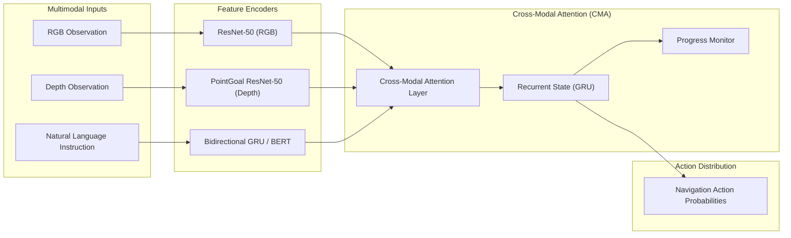

# HA-VLN Baseline Agents (agent)

This directory contains the baseline navigation policies, imitation learning trainers, and evaluation harnesses for the **HA-VLN 2.0** continuous benchmark, adapting settings from [VLN-CE](https://github.com/jacobkrantz/VLN-CE/).

---

## 1. HA-VLN-CMA Policy Architecture

The **Cross-Modal Attention (CMA)** agent (`CMAPolicy` in `VLN-CE/`) integrates multimodal observations with dynamic social-awareness constraints:



### Mathematical Formulation

1. **Visual Encoders**:
   - The RGB stream extracts spatial feature maps using a ResNet-50 backbone:
     $$v_t^{\text{rgb}} = \text{ResNet}(o_t^{\text{rgb}})$$
   - The depth stream extracts geometric scene structure using a frozen PointGoal navigation ResNet-50:
     $$v_t^{\text{depth}} = \text{ResNet}_{\text{PointGoal}}(o_t^{\text{depth}})$$
2. **Language Encoder**:
   - Instruction tokens $I = \{w_1, \ldots, w_L\}$ are encoded into contextual embeddings:
     $$l = \text{BiGRU}(I)$$
3. **Cross-Modal Fusion**:
   - A multi-head attention module aligns visual observations $v_t$ and language features $l$:
     $$f_t = \text{MultiHeadAttention}(v_t, l)$$
4. **Action Distribution**:
   - At each timestep $t$, an MLP predicts action probabilities over navigation primitives (Move Forward, Turn Left, Turn Right, Stop):
     $$P(a_t \mid f_t) = \text{Softmax}(\text{MLP}_{\text{action}}(f_t))$$
5. **Progress Monitor**:
   - A linear projection regularizes recurrent state representations by predicting normalized remaining geodesic distance to the goal:
     $$y_t = \sigma(\mathbf{w}_{\text{pm}}^\top h_t + b_{\text{pm}}) \in [0, 1]$$

---

## 2. Training with DAgger

### Prerequisites: PointGoal Depth Observation Weights
Baseline models encode depth observations using a ResNet-50 backbone pre-trained on PointGoal navigation (`gibson-2plus-resnet50.pth`). When training from scratch, download and extract the pre-trained weights to `Data/ddppo-models/`:

```bash
mkdir -p ../Data/ddppo-models
curl -fL --retry 3 \
  https://dl.fbaipublicfiles.com/habitat/data/baselines/v1/ddppo/ddppo-models.zip \
  -o ../Data/ddppo-models/ddppo-models.zip
unzip ../Data/ddppo-models/ddppo-models.zip -d ../Data/ddppo-models/
```

### Start Training
To train the HA-VLN-CMA policy from scratch using DAgger imitation learning:

```bash
# Ensure environment is active (Conda or Docker)
python run.py --exp-config config/cma_pm_da_aug_tune.yaml --run-type train
```

Checkpoints are automatically stored under `VLN-CE/data/checkpoints/cma_pm_da_aug_tune/`.

---

## 3. Evaluation & Published Benchmark Results

To evaluate the released pre-trained CMA policy on the validation splits:

```bash
# 1. Evaluate on val_unseen (primary benchmark split)
python run.py --exp-config config/cma_pm_da_aug_tune.yaml --run-type eval \
  MODEL.DEPTH_ENCODER.ddppo_checkpoint NONE VIDEO_OPTION "[]"

# 2. Evaluate on val_seen
python run.py --exp-config config/cma_pm_da_aug_tune.yaml --run-type eval \
  EVAL.SPLIT val_seen \
  MODEL.DEPTH_ENCODER.ddppo_checkpoint NONE VIDEO_OPTION "[]"
```

> **Note on `ddppo_checkpoint NONE`**: The released `ckpt.39.pth` checkpoint already contains pre-trained depth encoder weights; passing `ddppo_checkpoint NONE` bypasses redundant local PointGoal weight searches.

### Published Baseline Metrics

The following metrics reflect the published HA-VLN 2.0 evaluation results:

| Split | Success Rate (SR) ↑ | Navigation Error (NE, m) ↓ | Collision Rate (CR) ↓ | Total Collision Rate (TCR) ↓ |
|:---|:---:|:---:|:---:|:---:|
| `val_seen` | 0.165 | 6.230 | 0.638 | 13.271 |
| `val_unseen` | 0.114 | 6.502 | 0.689 | 22.352 |

---

## 4. Test Set Inference & Challenge Submission

To run inference on the held-out test split and export trajectories:

```bash
python run.py --exp-config config/cma_pm_da_aug_tune.yaml --run-type inference \
  MODEL.DEPTH_ENCODER.ddppo_checkpoint NONE VIDEO_OPTION "[]"
```

The resulting trajectory file is generated under `VLN-CE/data/checkpoints/cma_pm_da_aug_tune/evals/`. Refer to the [RoboWorld 2026 Participant Toolkit](https://github.com/F1y1113/havln-challenge) for official action replay, trajectory packaging, and leaderboard ranking.
