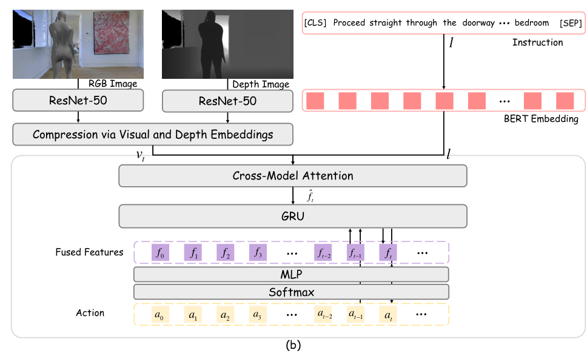

# HA-VLN Baseline Agents (agent)

This directory contains the baseline navigation policies, imitation learning trainers, and evaluation harnesses for the **HA-VLN 2.0** continuous benchmark, adapting settings from [VLN-CE](https://github.com/jacobkrantz/VLN-CE/).

---

## 1. HA-VLN-CMA Policy Architecture

The **Cross-Modal Attention (CMA)** agent (`CMAPolicy` in `VLN-CE/`) integrates multimodal observations with dynamic social-awareness constraints:

<div align="center">
  
  <p><em>Figure: HA-VLN-CMA policy architecture (adapted from Paper Figure 13(b)). Note: While the conceptual paper architecture discusses BERT instruction embeddings and multi-head attention, the released benchmark codebase implements a lightweight Bidirectional GRU (BiGRU) instruction encoder, scaled dot-product cross-modal attention, and a tanh progress monitor.</em></p>
</div>

### Mathematical Formulation

1. **Visual Encoders**:
   - The RGB stream extracts spatial feature representations using a ResNet-50 backbone:
     $$v_t^{\text{rgb}} = \text{ResNet}(o_t^{\text{rgb}})$$
   - The depth stream extracts geometric scene structure using a frozen PointGoal navigation ResNet-50:
     $$v_t^{\text{depth}} = \text{ResNet}_{\text{PointGoal}}(o_t^{\text{depth}})$$
2. **Language Encoder**:
   - Instruction tokens $I = \{w_1, \ldots, w_L\}$ are encoded into contextual representations using a Bidirectional GRU:
     $$l = \text{BiGRU}(I)$$
3. **Cross-Modal Attention**:
   - Scaled dot-product cross-modal attention computes alignment between recurrent agent state query $q(s_t)$ and instruction keys $k(l)$, followed by multimodal visual attention:
     $$f_t = \text{Softmax}\left(\frac{q(s_t) k(l)^\top}{\sqrt{d_k}}\right) v(l)$$
4. **Action Distribution**:
   - At each timestep $t$, a linear projection predicts action logits over navigation primitives (Move Forward, Turn Left, Turn Right, Stop):
     $$P(a_t \mid f_t) = \text{Softmax}(\text{Linear}_{\text{action}}(f_t))$$
5. **Progress Monitor**:
   - A linear projection with $\tanh$ activation predicts normalized progress towards the goal (supervised by oracle geodesic distance via `VLNOracleProgressSensor`):
     $$y_t = \tanh(\mathbf{w}_{\text{pm}}^\top h_t + b_{\text{pm}}) \in [-1, 1]$$
     trained via MSE against normalized geodesic distance progress.

---

## 2. Training with DAgger

### Prerequisites

1. **Working Directory**: Run all commands from the `agent/` directory:
   ```bash
   cd agent
   ```
2. **Training Data Split**: Quick Start's `--target all` downloads validation splits only. To train from scratch, download the training instructions and episodes (`HA-R2R/train/*`) from Hugging Face:
   ```bash
   pip install huggingface-hub
   hf download fly1113/HA-VLN --include "HA-R2R/train/*" --repo-type dataset --local-dir ../Data
   ```
3. **PointGoal Depth Observation Weights**: Baseline depth encoders require the pre-trained PointGoal navigation ResNet-50 weights (`gibson-2plus-resnet50.pth`). Download and extract directly into `Data/ddppo-models/`:
   ```bash
   mkdir -p ../Data/ddppo-models
   curl -fL --retry 3 \
     https://dl.fbaipublicfiles.com/habitat/data/baselines/v1/ddppo/ddppo-models.zip \
     -o ../Data/ddppo-models/ddppo-models.zip
   # Extract directly without nested directory prefix (-j strips archive paths)
   unzip -j -q ../Data/ddppo-models/ddppo-models.zip "data/ddppo-models/gibson-2plus-resnet50.pth" -d ../Data/ddppo-models/
   ```

### Start Training
To train the HA-VLN-CMA policy from scratch using DAgger imitation learning:

```bash
# Ensure environment is active (Conda or Docker)
python run.py --exp-config config/cma_pm_da_aug_tune.yaml --run-type train
```

Checkpoints are automatically stored under `VLN-CE/data/checkpoints/cma_pm_da_aug_tune/`.

---

## 3. Evaluation & Published Benchmark Results

To evaluate the released pre-trained CMA policy on the validation splits:

```bash
# 1. Evaluate on val_unseen (primary benchmark split)
python run.py --exp-config config/cma_pm_da_aug_tune.yaml --run-type eval \
  MODEL.DEPTH_ENCODER.ddppo_checkpoint NONE VIDEO_OPTION "[]"

# 2. Evaluate on val_seen
python run.py --exp-config config/cma_pm_da_aug_tune.yaml --run-type eval \
  EVAL.SPLIT val_seen \
  MODEL.DEPTH_ENCODER.ddppo_checkpoint NONE VIDEO_OPTION "[]"
```

> **Note on `ddppo_checkpoint NONE`**: The released `ckpt.39.pth` checkpoint already contains pre-trained depth encoder weights; passing `ddppo_checkpoint NONE` bypasses redundant local PointGoal weight searches.

### Published Baseline Metrics

The following metrics reflect the published HA-VLN 2.0 evaluation results:

| Split | Success Rate (SR) ↑ | Navigation Error (NE, m) ↓ | Collision Rate (CR) ↓ | Total Collision Rate (TCR) ↓ |
|:---|:---:|:---:|:---:|:---:|
| `val_seen` | 0.165 | 6.230 | 0.638 | 13.271 |
| `val_unseen` | 0.114 | 6.502 | 0.689 | 22.352 |

> *Metric Details: **Success Rate (SR)** measures collision-free navigation success (stopping within 3.0 m of the goal with 0 dynamic human collisions). **Navigation Error (NE)** measures the mean final Euclidean distance (in meters) to the goal. **Collision Rate (CR)** and **Total Collision Rate (TCR)** measure collision-episode frequency and adjusted collision counts with dynamic human avatars.*

