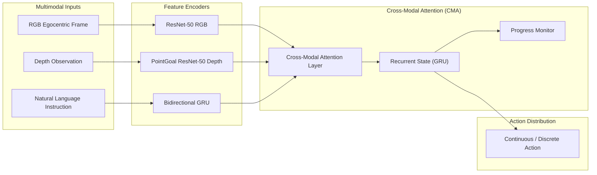

# HA-VLN Baseline Agents & Training Manual

This document details the policy architectures, training protocols, evaluation procedures, and challenge submission workflows for the baseline agents in **HA-VLN 2.0**.

---

## 1. HA-VLN-CMA Policy Architecture

The **Cross-Modal Attention (CMA)** agent (`CMAPolicy` in `agent/VLN-CE`) extends classical vision-and-language navigation with dynamic social awareness:



### Key Policy Components

1. **Instruction Encoder**: A bidirectional GRU maps tokenized instruction sequences into contextual embeddings:
   $$\mathbf{X} = \{\mathbf{x}_1, \mathbf{x}_2, \ldots, \mathbf{x}_L\}, \quad \mathbf{x}_i \in \mathbb{R}^{d_l}$$
2. **Visual Observation Encoders**:
   - **RGB Stream**: ResNet-50 extracts spatial feature maps $\mathbf{V}_t^{\text{rgb}}$.
   - **Depth Stream**: A frozen ResNet-50 pre-trained on PointGoal navigation extracts structural depth features $\mathbf{V}_t^{\text{depth}}$.
3. **Cross-Modal Attention**: Computes soft attention weights between the recurrent hidden state $\mathbf{h}_{t-1}$ and instruction tokens $\mathbf{X}$, producing attended text features conditioned on the visual view.
4. **Progress Monitor**: Predicts the normalized remaining geodesic distance to the goal $y_t \in [0, 1]$, regularizing navigation trajectories against premature stops.

---

## 2. Environment Setup & Pretrained Assets

Install the agent dependencies in your Python environment:

```bash
cd "$HA_VLN_ROOT"
python -m pip install -r requirements-py38.txt
```

### Pretrained Weights Breakdown

- **PointGoal Depth Weights**: `Data/ddppo-models/gibson-2plus-resnet50.pth` (required only when training policies from scratch). Download via [ddppo-models.zip](https://dl.fbaipublicfiles.com/habitat/data/baselines/v1/ddppo/ddppo-models.zip).
- **Released CMA Checkpoint**: `Data/checkpoints/HA-VLN-CMA/ckpt.39.pth`. Download via 1-click script:
  ```bash
  python scripts/download_hf.py --destination Data --target cma
  mkdir -p agent/VLN-CE/data/checkpoints/cma_pm_da_aug_tune
  cp Data/checkpoints/HA-VLN-CMA/ckpt.39.pth \
    agent/VLN-CE/data/checkpoints/cma_pm_da_aug_tune/CMA_PM_DA_Aug.pth
  ```

---

## 3. Training from Scratch

We train the HA-VLN-CMA baseline using **DAgger (Dataset Aggregation)** imitation learning:

```bash
cd agent
python run.py --exp-config config/cma_pm_da_aug_tune.yaml --run-type train
```

### Key Training Parameters

- **Teacher Forcing Ratio**: Annealed dynamically across epochs.
- **Data Augmentation**: Trajectory perturbations and scene sampling.
- **Loss Formulation**: Combined cross-entropy action imitation loss and Mean Squared Error (MSE) progress monitor loss:
  $$\mathcal{L} = \mathcal{L}_{\text{action}} + \lambda_{\text{pm}} \mathcal{L}_{\text{pm}}$$

---

## 4. Benchmark Evaluation & Validation

To evaluate the pre-trained CMA policy on the validation splits:

```bash
cd agent

# 1. Evaluate on val_unseen (unseen environments - primary benchmark split)
python run.py --exp-config config/cma_pm_da_aug_tune.yaml --run-type eval \
  MODEL.DEPTH_ENCODER.ddppo_checkpoint NONE VIDEO_OPTION "[]"

# 2. Evaluate on val_seen (seen environments)
python run.py --exp-config config/cma_pm_da_aug_tune.yaml --run-type eval \
  EVAL.SPLIT val_seen \
  MODEL.DEPTH_ENCODER.ddppo_checkpoint NONE VIDEO_OPTION "[]"
```

> **Note on `ddppo_checkpoint NONE`**: The released `ckpt.39.pth` checkpoint already contains pre-trained depth encoder weights; setting `ddppo_checkpoint NONE` bypasses redundant local weight searches.

### Published Benchmark Baseline Results

| Split | Success Rate (SR) ↑ | Navigation Error (NE, m) ↓ | Collision Rate (CR) ↓ | Total Collision Rate (TCR) ↓ |
|:---|:---:|:---:|:---:|:---:|
| **`val_seen`** | 0.165 | 6.230 | 0.638 | 13.271 |
| **`val_unseen`** | 0.114 | 6.502 | 0.689 | 22.352 |

---

## 5. Test Set Inference & Challenge Submission

To run inference on the held-out test split and export trajectories:

```bash
cd agent
python run.py --exp-config config/cma_pm_da_aug_tune.yaml --run-type inference \
  MODEL.DEPTH_ENCODER.ddppo_checkpoint NONE VIDEO_OPTION "[]"
```

The resulting trajectory file is generated under `agent/VLN-CE/data/checkpoints/cma_pm_da_aug_tune/evals/`. Follow the [RoboWorld 2026 HA-VLN Participant Toolkit](https://github.com/F1y1113/havln-challenge) to package your submission for the official leaderboard.

---

## 6. HA-VLN-VL Model Overview (Paper Study)

> [!NOTE]
> **Implementation Scope Note**: The HA-VLN paper investigates both **HA-VLN-CMA** and **HA-VLN-VL** ([Recurrent VLN-BERT](https://github.com/YicongHong/Recurrent-VLN-BERT) adaptation). In this repository, **HA-VLN-CMA** is the officially released, runnable, and benchmarked baseline (with full codebase in `agent/` and released checkpoint `ckpt.39.pth`). HA-VLN-VL is described in the paper as an exploratory study and its model code is not part of this release.

In addition to CMA, the paper investigates **HA-VLN-VL**, adapting Recurrent VLN-BERT to resolve misalignment between visual cues and navigation instructions:

$$s_t, p_t^a = \text{HA-VLN-VL}(s_{t-1}, X, V_t)$$

where $s_t$ represents the recurrent state, $p_t^a$ denotes predicted action probabilities, $X$ contains instruction language tokens, and $V_t$ denotes egocentric visual tokens. HA-VLN-VL processes multimodal inputs via multi-layer Transformer self-attention.
