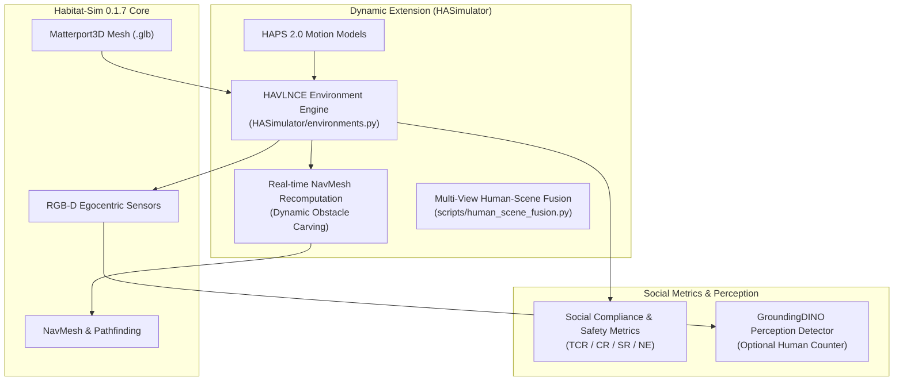

# HA-VLN Simulator Architecture & API Manual

The **HA-VLN Simulator** (`HASimulator/`) extends Habitat-Sim with dynamic 3D human motion simulation, real-time navigation mesh recomputation, multi-view quality verification, and unified social distance evaluation APIs.

---

## 1. System Architecture

The simulator coordinates real-time dynamic human mesh insertion, physics recalculation, egocentric observation rendering, and social compliance metrics:



---

## 2. Real-time Human Rendering Engine

Human Rendering is implemented in the class **`HAVLNCE`** of [`HASimulator/environments.py`](../HASimulator/environments.py).

### Multi-Threading Execution Model
- **Worker Thread**: Manages continuous time tracking, human model frame interpolation (120-frame SMPL mesh sequences), and motion dispatching.
- **Main Thread**: Adds and removes human meshes from the simulator scene graph, queries collision bounds, and synchronizes the agent's physics step.

### NavMesh Recomputation & Caching
Because moving humans occupy space, the navigable mesh must reflect dynamic obstacle bounds:
1. On the first episode in a scene, the simulator computes the dynamic navigation mesh accounting for human clearance and saves the result to `RECOMPUTE_NAVMESH_PATH` (`Data/recompute_navmesh`).
2. Subsequent episodes directly load the pre-computed NavMesh cache to maximize simulation throughput.

### Task Configuration Settings

In [`HASimulator/config/HAVLNCE_task.yaml`](../HASimulator/config/HAVLNCE_task.yaml):

```yaml
SIMULATOR:
  TYPE: "HAVLNCE"
  ADD_HUMAN: True
  HUMAN_GLB_PATH: ../Data/HAPS2_0
  HUMAN_INFO_PATH: ../Data/Multi-Human-Annotations/human_motion.json
  RECOMPUTE_NAVMESH_PATH: ../Data/recompute_navmesh
  HUMAN_COUNTING: False  # Set to True when using optional GroundingDINO human counting
```

---

## 3. Multi-View Human-Scene Fusion (Quality Verification)

To identify visual artifacts (such as model clipping, floating meshes, or abnormal lighting) during dataset annotation, the simulator includes a 9-camera multi-view capture pipeline in [`scripts/human_scene_fusion.py`](../scripts/human_scene_fusion.py).

### Mathematical Camera Setup

Each candidate human model is surrounded by **9 RGB cameras**:
- **8 Side Cameras**: Distributed horizontally at angles:
  $$\theta_{\text{lr}}^{i} = \frac{\pi \cdot i}{8}, \quad i \in \{1, 2, \ldots, 8\}$$
  with alternating up/down tilt angles to verify foot placement and head clearance.
- **1 Overhead Camera**: Positioned directly above the human model:
  $$\theta_{\text{ud}}^{9} = \frac{\pi}{2}$$
  to verify social distance boundaries against nearby furniture and walls.

### Running Multi-View Rendering

```bash
cd scripts
python3 human_scene_fusion.py
```

Frames are rendered to `scripts/test/` by default. You can adjust the output location by modifying `output_path` inside `human_scene_fusion.py`. Verified multi-view annotation videos are available in the [Google Drive Archive](https://drive.google.com/drive/folders/1XvGHgLJ0MFDNY_k_iVwE_oGpfBfBaZif?usp=sharing).

---

## 4. Unified Simulator APIs & Social Evaluation Measures

The simulator defines specialized sensors and evaluation measures in [`HASimulator/measures.py`](../HASimulator/measures.py) and [`HASimulator/metric.py`](../HASimulator/metric.py) to assess agent behavior under dynamic human presence:

| API / Measure | Implementation | Role & Mathematical Meaning |
|:---|:---:|:---|
| **`distance_to_human`** | Sensor / Measure | Calculates the Euclidean distance $d(p_t^{\text{agent}}, p_t^{\text{human}})$ and relative bearing angle between the robot and every dynamic human in the scene at timestep $t$. |
| **`collisions_detail`** | Safety Measure | Distinguishes physical obstacle collisions from social personal-space infractions (breaching the $\epsilon = 1.0\text{m}$ social clearance sphere). |
| **`human_counting`** | Perception Measure | Tracks the number of visible individuals within the agent's egocentric FOV using open-set detection ([`HASimulator/detector.py`](../HASimulator/detector.py)). |
| **Total Collision Rate (TCR)** | Benchmark Metric | Cumulative collision infractions per episode across both static environment structures and dynamic humans. |
| **Collision Rate (CR)** | Benchmark Metric | Proportion of navigation episodes where at least one collision infraction occurred ($CR \in [0, 1]$). |
| **Success Rate (SR)** | Benchmark Metric | Binary task completion indicating whether the agent stopped within $3.0\text{m}$ of the target position. |
| **Navigation Error (NE)** | Benchmark Metric | Mean geodesic distance ($\text{meters}$) from the agent's final stopping location to the target coordinate. |

---

## 5. Task Configuration Presets

The repository provides 4 pre-configured task configuration profiles in [`HASimulator/config/`](../HASimulator/config/):

1. **`HAVLNCE_task.yaml`**: The primary continuous navigation benchmark containing dynamic humans, HAPS 2.0 motion models, and social distance measurements.
2. **`HAVLNCE_R2R_task.yaml`**: Evaluates continuous navigation on original R2R routes populated with dynamic humans.
3. **`VLNCE_task.yaml`**: Standard VLN-CE setup without dynamic human agents (static baseline comparison).
4. **`VLNCE_HAR2R_task.yaml`**: Evaluates agent behavior using HA-R2R language instructions inside static continuous environments.

---

## 6. Interactive Keyboard Exploration

You can navigate through photorealistic Matterport3D environments interactively using keyboard controls:

| Key | Action |
|:---:|:---|
| **W** | Move forward ($0.25\text{m}$) |
| **A** | Turn left ($15^{\circ}$) |
| **D** | Turn right ($15^{\circ}$) |

### Running Exploration

**Docker:**
```bash
docker run --gpus all -it --rm \
  --shm-size 16g \
  --mount type=bind,source="$(pwd)",target=/workspace/HA-VLN \
  --mount type=bind,source="$DATA_DIR",target=/workspace/HA-VLN/Data \
  --mount type=bind,source="$DATA_DIR",target=/data/havln2 \
  --workdir /workspace/HA-VLN/scripts \
  "$IMAGE" python demo.py --scan 1LXtFkjw3qL
```

**Native:**
```bash
cd scripts
python demo.py --scan 1LXtFkjw3qL
```
*(Replace `1LXtFkjw3qL` with any downloaded Matterport3D scene scan ID).*
